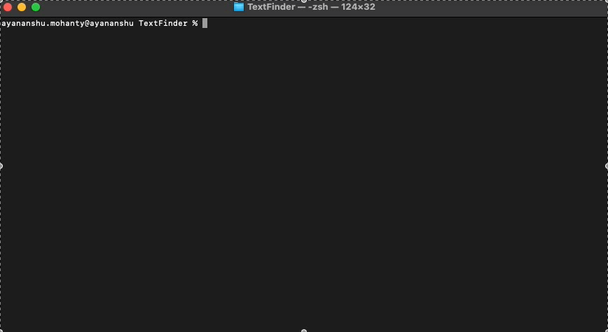
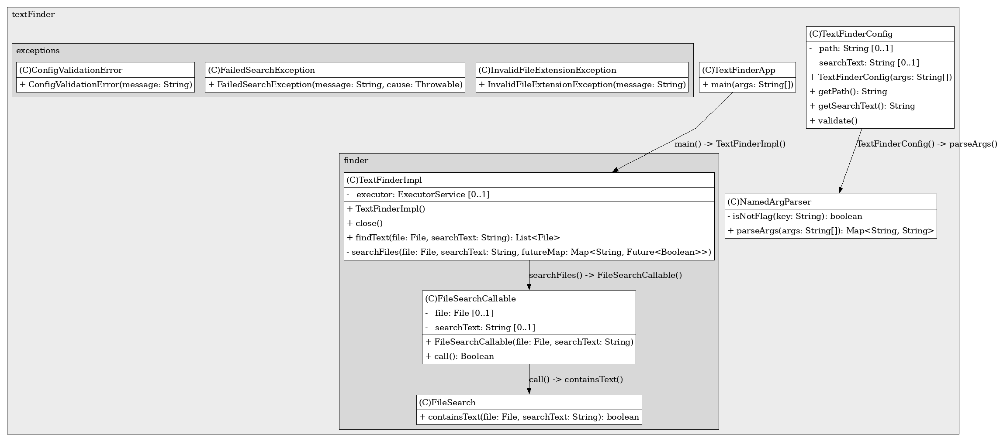

# TextFinder

## Overview

A multithreaded Java-based text search utility that recursively scans .txt files within a given directory for a specific text string.

***

## Steps to run

1. Build the Java application

```sh
./build.sh
```

2. Start the application

```sh
./run.sh --path <absolute-path-to-directory> --searchText <text-to-search-for>
```

Following is a demo of the app:



***

## Architecture



***

## com.textFinder.TextFinderApp

This is the main class. It takes the absolute path to a file/directory and the search text as command line arguments.
Use flag --path to provide the absolute path and use flag --searchText to provide the string to search for.

## com.textFinder.finder.TextFinder

This interface defines a contract for any class that wants to implement the text searching functionality.
The implementation can be swapped without changing the code that uses the interface.
It extends Closeable to ensure that implementations can be safely used with try-with-resources for proper cleanup.
